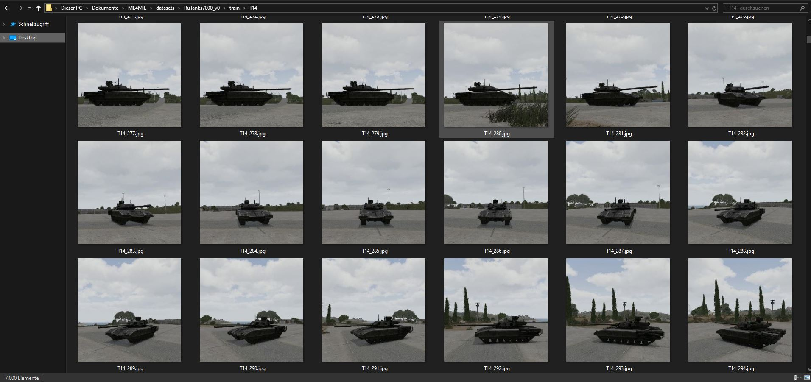
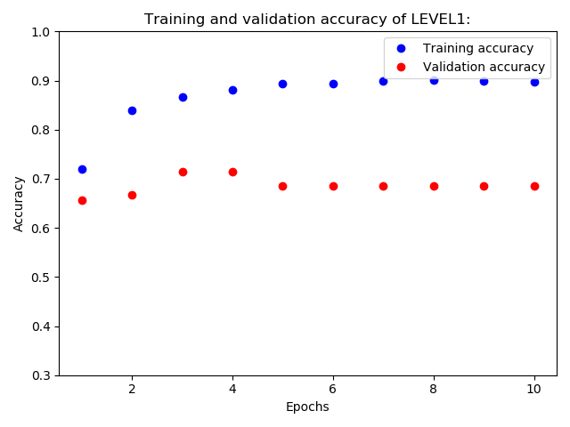
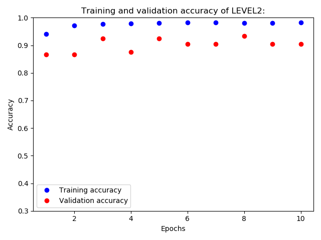
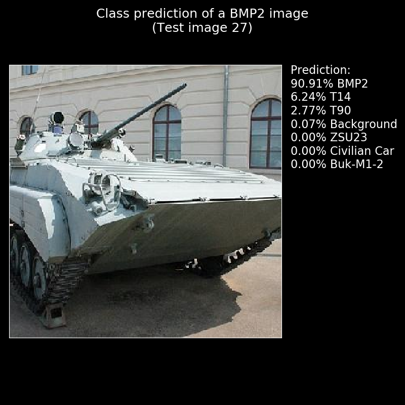
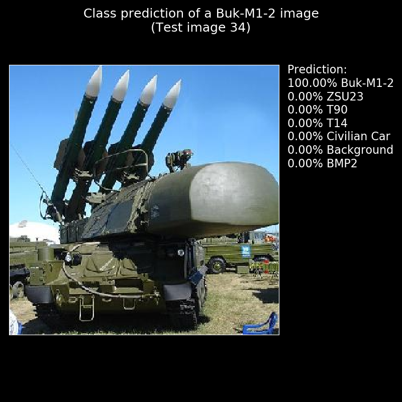
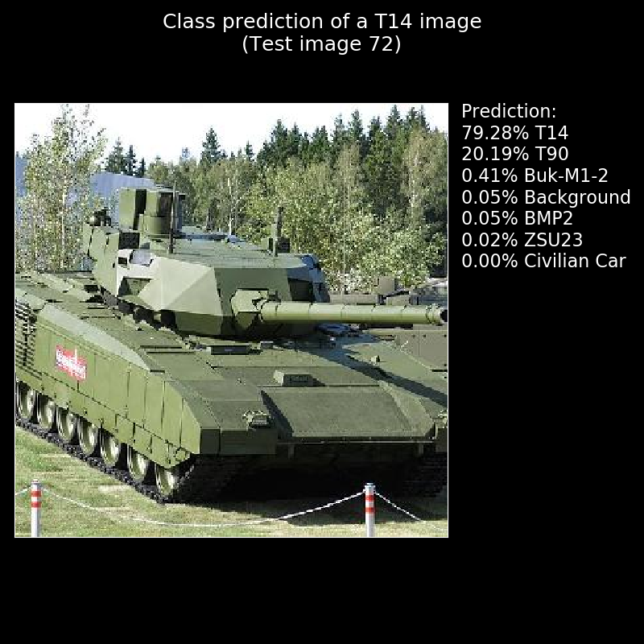
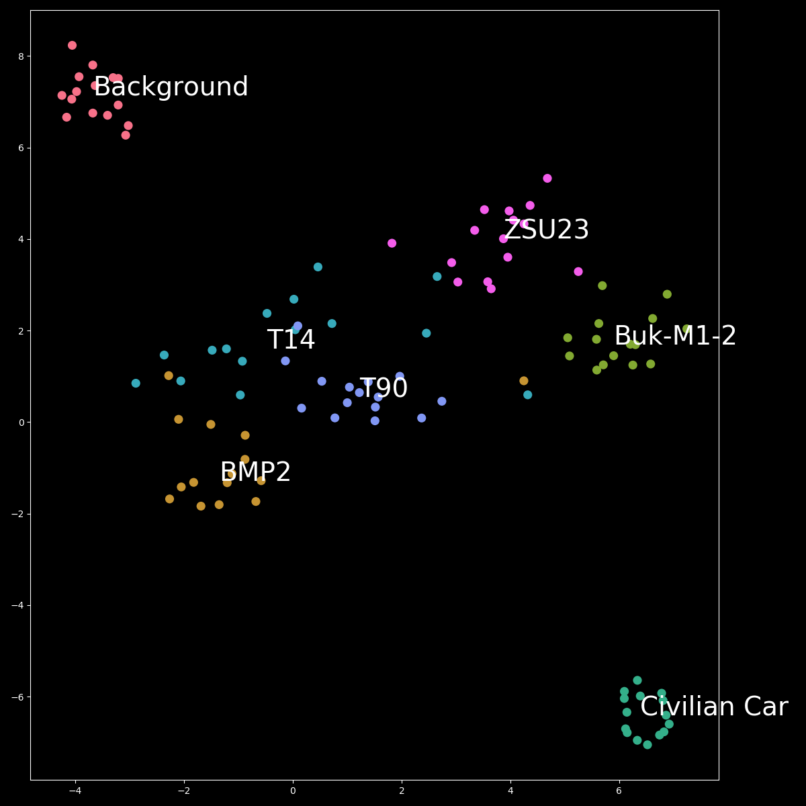
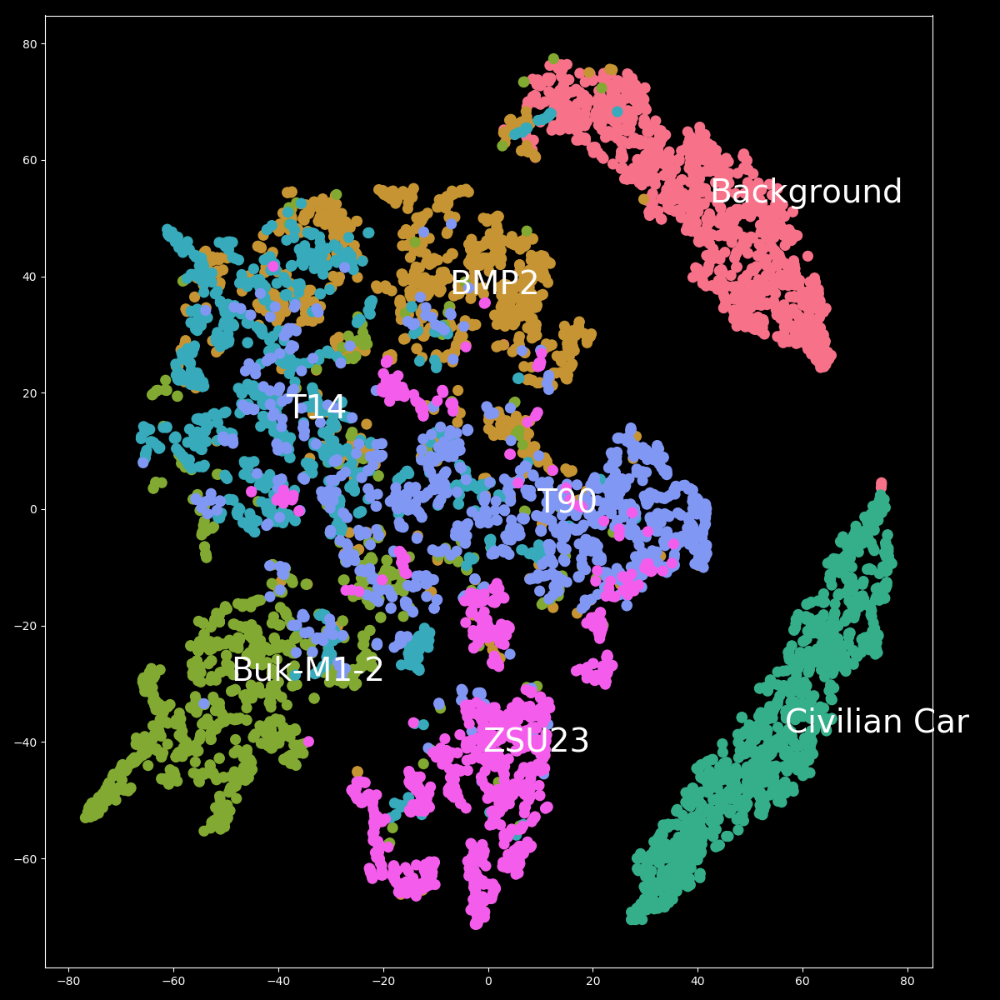

# Image Classification

## Introduction
Deep neural networks for image classification have already proved to be highly useful in industrial applications but require vast amounts of human-annotated images to be reliable. 
Here the game engine [Arma3](https://arma3.com/) is used to generate synthetic images of various military vehicles in diverse situations. For instance, the angles and distances from which the vehicles are seen, and their locations can be varied. 
The synthetic images are then used to train deep neural networks, and their performance is evaluated on real-world images. 

## Purpose Statement
The purpose of this project is to explore to what extent synthetic images can be used to train deep neural networks for the classification of military vehicles in real images. 

## Training deep neural networks for classification of military vehicles on images
### Synthetic dataset with 7 classes: Background, [BMP-2](https://en.wikipedia.org/wiki/BMP-2), [Buk-M1-2](https://en.wikipedia.org/wiki/Buk_missile_system), [Civilian Car](https://en.wikipedia.org/wiki/Car), [T-14](https://en.wikipedia.org/wiki/T-14_Armata), [T-90](https://en.wikipedia.org/wiki/T-90), [ZSU-23-4](https://en.wikipedia.org/wiki/ZSU-23-4_Shilka):

### [The dataset as zipfile can be downloaded here (823mb)](https://onedrive.live.com/download?cid=D57BE18797CC43E3&resid=D57BE18797CC43E3%21511654&authkey=AJq_8Esq8bsTl1o)

**49000 Training images (7000 per class):** 
- Training Images classes "T14", and "Background" created with [Arma3](https://arma3.com/)
- Training Images classes "T90", "BMP2", and "ZSU-23", created with [Arma3](https://arma3.com/) and Arma3 Steam workshop content [RHSAFRF](https://steamcommunity.com/sharedfiles/filedetails/?id=843425103&searchtext=RHS)
- Training Images class "Buk-M1-2" created  with [Arma3](https://arma3.com/) and Arma3 Steam workshop content [POOK SAM PACK](https://steamcommunity.com/sharedfiles/filedetails/?id=1154375007&searchtext=Pook+SAM)
- All Images class "Civilian Car" adapted from [Cars Dataset](https://ai.stanford.edu/~jkrause/cars/car_dataset.html)

Training images T-14 example:

**105 Test images (15 per class):**
- Please check the image references section below for detailed references of the test images!

### Using Keras and Tensorflow as backend for Transfer Learning:
Using this [**python code for training**](code/RuTanks_train.py). Please adapt the following lines:

- line 34 - replace the path to the unzipped dataset: dataset_path = 'C:\\Users\\YOURNAME\\...\\RuTanks7000\\'
- line 35 - replace the weights path: weights_path = 'C:\\Users\\YOURNAME\\weights\\weights_temp.h5'
- line 36 - replace the model path: model_path = 'C:\\Users\\YOURNAME\\trained_models\\RuTanks7000_mX_'
- line 37 - replace the path to your TensorBoardLogDir: TensorBoardLogDir = 'C:\\Users\\YOURNAME\\logs'

Notes for the training:
* **Lower the batchsize if you dont have at least 6GB gpu memory!**
* **If you dont have access to your own GPU, try** [**Google Colab**](https://colab.research.google.com/)
* **Training on CPU is not recommended, unless you have a time machine...**

### Results
**Validation accuracy: 0.91** after 20 epochs. Training took 519 minutes on [Nvidia Geforce RTX 2060](https://www.nvidia.com/en-us/geforce/graphics-cards/rtx-2060/), (Keras 2.2.4, Tensorflow-gpu 1.14.0)

#### Validation accuracy of Level1 (after 10 Epochs): 0.71

#### Validation accuracy of Level2 (after additional 10 Epochs): 0.91

[**The Tensorboard logfiles can be found here**](results/logs)

## Analyzing the trained model:
If you want to skip the Training, you can download and use my [**RuTanks7000_v1_l2.h5 model file (442mb)**](https://drive.google.com/file/d/1ozbwzliRF6zVs7M4PXMUMctrck2FllDh/view?usp=sharing)

Use this [**python code for analyzing**](code/RuTanks_analyze.py). You will need to adapt the following lines:

- line 21 - replace the path to the trained model: model_path = 'Your trained model path here'
- line 22 - replace the path to the test folder of the dataset: 'C:/Users/YourName/.../RuTanks7000_v1/test/'

### Confusion Matrix and Classification Report:

### Here are some class predictions:

### [**Class predictions for all 105 test images can be found here**](analysis)

### Here is a tSNE visualization (t-Distributed Stochastic Neighbor Embedding for visualizing high-dimensional data) of the 105 test images:

### Here is a tSNE visualization of 7000 test images (Not included in the provided dataset):

The Test accuracy on these 7000 Test images is 0.7185 (guessing at 7 classes would be 0.1429!)

I would like to encourage you at this point to try out more test images! Have fun. 

## Conclusion
These results have shown that synthetically generated images can be used to train deep train neural networks in order to identify military vehicles on real-world images.

## Future Research
- Testing on more real images
- Using synthetic images as supplement to real images
- Using synthetic Heat signature images for training

## Updates

#### DECEMBER 21 2019: Check out my new [NOTEBOOK ON GOOGLE COLAB](https://colab.research.google.com/github/UgurUysal86/MLS4MIL/blob/master/Image%20Classification/code/RuTanks7000_v2.ipynb) including the following improvements:
* Created the 5RuTanks7000_v2 dataset, a reduced dataset from the original "RuTanks7000_v1" dataset without the class "Civilian Car".
* The dataset is now read directly into Google Colab from Google Drive. 

#### JULY 31 2020: Check out my new [NOTEBOOK ON GOOGLE COLAB](https://colab.research.google.com/drive/1hD4BGY_y4Ab8i4RJOUIPUMeCAU1vxoti?usp=sharing) including the following improvements:
* Using TensorFlow 2.2.0.
* Implementation of the latest [**fine-tuning techniques**](https://keras.io/guides/transfer_learning/).
* Using the TensorFlow.Keras implementation of the state-of-the-art pre-trained Neural Network [**EfficientNet**](https://arxiv.org/abs/1905.11946). 
* The test accuracy on the provided test set with 105 images improved from 91% to 93% and on additional 7000 real images (not provided) improved from 0.7185 to 0.8270 while the model size was reduced from 442mb to 70mb! 
* The dataset can now be downloaded as a zip file. 
* The dataset is now read directly into Google Colab using !wget.
* The possibility to test individual additional images is implemented (use Chrome-Webbrowser).
* The possibility to download the trained model after training directly from Google Colab is implemented. 
* If you want to skip training, download and use my trained model (70mb) [5RuTanks7000_v1_EfficientNetB4_public.h5](https://onedrive.live.com/download?cid=D57BE18797CC43E3&resid=D57BE18797CC43E3%21511704&authkey=APWmmFUO4_71Qqg).
* If you want to use the model to classify images with python make sure to install and import efficientnet.tfkeras. 
* Alternatively, you can view the [NOTEBOOK ON GITHUB](https://github.com/UgurUysal86/MLS4MIL/blob/master/Image%20Classification/code/5RuTanks7000_v1_EfficientNetB4_public.ipynb)

## References
* [Chollet, F. (2018). Deep learning with Python. Section 5.3 - Using a pretrained convnet](https://www.manning.com/books/deep-learning-with-python)
* [Chollet, F. (2020). Complete guide to transfer learning & fine-tuning in Keras.](https://keras.io/guides/transfer_learning/)
* [Mingxing Tan and Quoc V. Le. EfficientNet: Rethinking Model Scaling for Convolutional Neural Networks. ICML 2019](https://arxiv.org/abs/1905.11946)
* [Pathak, M (2018). Introduction to t-SNE.](https://www.datacamp.com/community/tutorials/introduction-t-sne)

## Test Image References
**Background Test Images:** 
- [Test Images 1-15: Microsoft Research Cambridge Object Recognition Image Database](https://www.microsoft.com/en-us/download/details.aspx?id=52644)

**BMP-2 Test Images:**
- [Test Image 16](https://commons.wikimedia.org/wiki/File:BMP-2.JPG), posted by Termos, licensed under [CC BY-SA 3.0](https://creativecommons.org/licenses/by-sa/3.0/deed.en), cropped to 331x331 pixels.
- [Test Image 17](https://de.m.wikipedia.org/wiki/Datei:BMP-2_NVA.JPG), posted by Billyhill, licensed under [CC BY 3.0](https://creativecommons.org/licenses/by/3.0/deed.en), cropped to 331x331 pixels.
- [Test Image 18](https://en.wikipedia.org/wiki/File:Afghan_National_Army_BMP-2.JPEG), posted by U.S. Army, licensed under [CC0 1.0](https://creativecommons.org/publicdomain/zero/1.0/deed.en), cropped to 331x331 pixels.
- [Test Image 19](https://commons.wikimedia.org/wiki/File:BMP-2_military_parade_rehearsal.jpg), posted by Фальшивомонетчик , licensed under [CC0 1.0](https://creativecommons.org/publicdomain/zero/1.0/deed.en), cropped to 331x331 pixels.
- [Test Image 20](https://commons.wikimedia.org/wiki/File:BMP-2_-_TankBiathlon14part1-12.jpg), posted by Vitaly V. Kuzmin, licensed under [CC BY-SA 4.0](https://creativecommons.org/licenses/by-sa/4.0/deed.en), cropped to 331x331 pixels.
- [Test Image 21](https://de.wikipedia.org/wiki/Datei:BMP-2_Aberdeen_Proving_Ground.JPG), posted by Mark Pellegrini, licensed under [CC BY-SA 2.5](https://creativecommons.org/licenses/by-sa/2.5/deed.en), cropped to 331x331 pixels.
- [Test Image 22](https://commons.wikimedia.org/wiki/File:BMP-2_-_TankBiathlon14part1-13.jpg), posted by Vitaly V. Kuzmin, licensed under [CC BY-SA 4.0](https://creativecommons.org/licenses/by-sa/4.0/deed.en), cropped to 331x331 pixels.
- [Test Image 23](https://commons.wikimedia.org/wiki/File:BMP-2_near_Yavoriv,_Ukraine.jpg), posted by Staff Sgt. Adriana Diaz-Brown, licensed under [CC0 1.0](https://creativecommons.org/publicdomain/zero/1.0/deed.en), cropped to 331x331 pixels.
- [Test Image 24](https://commons.wikimedia.org/wiki/File:BMP-2_on_IMG-2017.jpg), posted by Mil.ru, licensed under [CC BY 4.0](https://creativecommons.org/licenses/by/4.0/deed.en), cropped to 331x331 pixels.
- [Test Image 25](https://commons.wikimedia.org/wiki/File:Yudh_Abhyas-09_BMP.JPG), posted by Fred W. Baker III, licensed under [CC0 1.0](https://creativecommons.org/publicdomain/zero/1.0/deed.en), cropped to 331x331 pixels.
- [Test Image 26](https://commons.wikimedia.org/wiki/File:BMP-2_of_Russian_Ground_Forces.jpg), posted by Mil.ru, licensed under [CC BY 4.0](https://creativecommons.org/licenses/by/4.0/deed.en), cropped to 331x331 pixels.
- [Test Image 27](https://commons.wikimedia.org/wiki/File:BMP-2_from_1983,_Bundeswehr_Military_History_Museum,_Dresden.jpg), posted by Stephencdickson, licensed under [CC BY-SA 4.0](https://creativecommons.org/licenses/by-sa/4.0/deed.en), cropped to 331x331 pixels.
- [Test Image 28](https://commons.wikimedia.org/wiki/File:Russian_BMP-2_IFV.jpg), posted by Jno, licensed under [CC BY-SA 1.0](https://creativecommons.org/licenses/by-sa/1.0/deed.en), cropped to 331x331 pixels.
- [Test Image 29](https://commons.wikimedia.org/wiki/File:BMP-2_2.JPG), posted by Mark Pellegrini, licensed under [CC BY-SA 2.5](https://creativecommons.org/licenses/by-sa/2.5/deed.en), cropped to 331x331 pixels.
- [Test Image 30](https://commons.wikimedia.org/wiki/File:BMP-2_tank_at_the_Open_landmachtdagen_2010.jpg), posted by Alf van Beem, licensed under [CC0 1.0](https://creativecommons.org/publicdomain/zero/1.0/deed.en), cropped to 331x331 pixels.

**Buk-M1-2 Test Images:**
- [Test Image 31](https://en.m.wikipedia.org/wiki/File:BUK_file1.jpg), posted by Stanislav Kozlovskiy, licensed under [CC0 1.0](https://creativecommons.org/publicdomain/zero/1.0/deed.en), cropped to 331x331 pixels.
- [Test Image 32](https://www.flickr.com/photos/df77/41253216854), posted by Dmitriy Fomin, licensed under [CC BY 2.0](https://creativecommons.org/licenses/by/2.0/), cropped to 331x331 pixels.
- [Test Image 33](https://www.flickr.com/photos/df77/27053439937), posted by Dmitriy Fomin, licensed under [CC BY 2.0](https://creativecommons.org/licenses/by/2.0/), cropped to 331x331 pixels.
- [Test Image 34](https://de.m.wikipedia.org/wiki/Datei:Buk-M1-2_9A310M1-2.jpg), posted by .:Ajvol:., licensed under [CC0 1.0](https://creativecommons.org/publicdomain/zero/1.0/deed.en), cropped to 331x331 pixels.
- [Test Image 35](https://de.wikipedia.org/wiki/Datei:9K37_Buk_M1_SA-11_Gadfly.JPG), posted by Olli-Jukka Paloneva, licensed under [CC0 1.0](https://creativecommons.org/publicdomain/zero/1.0/deed.en), cropped to 331x331 pixels.
- [Test Image 36](https://commons.wikimedia.org/wiki/File:Buk-M2-MAKS-2007.jpg), posted by Участник:Xchgall, licensed under [CC0 1.0](https://creativecommons.org/publicdomain/zero/1.0/deed.en), cropped to 331x331 pixels.
- [Test Image 37](https://commons.wikimedia.org/wiki/File:ZRK_BUK_M1_2005_G1.jpg), posted by George Chernilevsky, licensed under [CC BY-SA 3.0](https://creativecommons.org/licenses/by-sa/3.0/deed.en), cropped to 331x331 pixels.
- [Test Image 38](https://commons.wikimedia.org/wiki/File:Buk-M2,_2009_Victory_parade.JPG), posted by piligrims74 (Anton), licensed under [CC BY-SA 3.0](https://creativecommons.org/licenses/by-sa/3.0/deed.en), cropped to 331x331 pixels.
- [Test Image 39](https://commons.wikimedia.org/wiki/File:Buk-M1,_Kyiv_2018,_44.jpg), posted by VoidWanderer, licensed under [CC BY-SA 4.0](https://creativecommons.org/licenses/by-sa/4.0/deed.en), cropped to 331x331 pixels.
- [Test Image 40](https://en.wikipedia.org/wiki/File:2008_Moscow_Victory_Day_Parade_-_BUK_SAM.jpg), posted by Пользователь, licensed under [CC BY 3.0](https://creativecommons.org/licenses/by/3.0/deed.en), cropped to 331x331 pixels.
- [Test Image 41](https://commons.wikimedia.org/wiki/File:ZRK_BUK_M1_in_Vinnytsia_2016.jpg), posted by Vitaliy Trubnykov, licensed under [CC BY-SA 4.0](https://creativecommons.org/licenses/by-sa/4.0/deed.en), cropped to 331x331 pixels.
- [Test Image 42](https://commons.wikimedia.org/wiki/File:9A310_self-propelled_launch_vehicle_for_Buk-M1-2_Air_defence_system.jpg), posted by Vitaly V. Kuzmin, licensed under [CC BY-SA 4.0](https://creativecommons.org/licenses/by-sa/4.0/deed.en), cropped to 331x331 pixels.
- [Test Image 43](https://commons.wikimedia.org/wiki/File:ParkPatriot2015part8-23.jpg), posted by  Vitaly V. Kuzmin, licensed under [CC BY-SA 4.0](https://creativecommons.org/licenses/by-sa/4.0/deed.en), cropped to 331x331 pixels.
- [Test Image 44](https://commons.wikimedia.org/wiki/File:Engineering_Technologies_-_2012_(1-44).jpg), posted by  Vitaly V. Kuzmin, licensed under [CC BY-SA 4.0](https://creativecommons.org/licenses/by-sa/4.0/deed.en), cropped to 331x331 pixels.
- [Test Image 45](https://commons.wikimedia.org/wiki/File:13April-Rehersal-Alabino-29.jpg), posted by  Vitaly V. Kuzmin, licensed under [CC BY-SA 4.0](https://creativecommons.org/licenses/by-sa/4.0/deed.en), cropped to 331x331 pixels.

**Civilian Car Training & Test Images:**  
- [Test Images 46-60: Cars Dataset](https://ai.stanford.edu/~jkrause/cars/car_dataset.html)

**T-14 Test Images:**
- [Test Image 61](https://commons.wikimedia.org/wiki/File:T14-armata.jpg), posted by  Vitaly V. Kuzmin, licensed under [CC BY-SA 4.0](https://creativecommons.org/licenses/by-sa/4.0/deed.en), cropped to 331x331 pixels.
- [Test Image 62](https://commons.wikimedia.org/wiki/File:Main_battle_tank_T-14_-_0-01.jpg), posted by Vitaly V. Kuzmin, licensed under [CC BY-SA 3.0](https://creativecommons.org/licenses/by-sa/3.0/deed.en), cropped to 331x331 pixels.
- [Test Image 63](https://de.wikipedia.org/wiki/Datei:4mayrehearsal_09.jpg), posted by Vitaly V. Kuzmin, licensed under [CC BY-SA 4.0](https://creativecommons.org/licenses/by-sa/4.0/deed.en), cropped to 331x331 pixels.
- [Test Image 64](https://commons.wikimedia.org/wiki/File:9may2015Moscow-01_(cropped).jpg), posted by Vitaly V. Kuzmin, licensed under [CC BY-SA 4.0](https://creativecommons.org/licenses/by-sa/4.0/deed.en), cropped to 331x331 pixels.
- [Test Image 65](https://commons.wikimedia.org/wiki/File:T-14_Armata_(41072263955).jpg), posted by Dmitriy Fomin, licensed under [CC BY 2.0](https://creativecommons.org/licenses/by/2.0/deed.en), cropped to 331x331 pixels.
- [Test Image 66](https://commons.wikimedia.org/wiki/File:%D0%A2%D0%B0%D0%BD%D0%BA_%C2%AB%D0%90%D1%80%D0%BC%D0%B0%D1%82%D0%B0%C2%BB_%D0%A2-14.JPG), posted by Соколрус, licensed under [CC BY-SA 4.0](https://creativecommons.org/licenses/by-sa/4.0/deed.en), cropped to 331x331 pixels.
- [Test Image 67](https://commons.wikimedia.org/wiki/File:T-14_Armata_(27053434067).jpg), posted by Dmitriy Fomin, licensed under [CC BY 2.0](https://creativecommons.org/licenses/by/2.0/deed.en), cropped to 331x331 pixels.
- [Test Image 68](https://commons.wikimedia.org/wiki/File:T-14_Armata_(41072270525).jpg), posted by Dmitriy Fomin, licensed under [CC BY 2.0](https://creativecommons.org/licenses/by/2.0/deed.en), cropped to 331x331 pixels.
- [Test Image 69](https://commons.wikimedia.org/wiki/File:T-14_prototype_from_above.JPG), posted by Boevaya mashina, licensed under [CC BY-SA 4.0](https://creativecommons.org/licenses/by-sa/4.0/deed.en), cropped to 331x331 pixels.
- [Test Image 70](https://commons.wikimedia.org/wiki/File:Main_battle_tank_T-14_-_0-03.jpg), posted by Vitaly V. Kuzmin, licensed under [CC BY-SA 3.0](https://creativecommons.org/licenses/by-sa/3.0/deed.en), cropped to 331x331 pixels.
- [Test Image 71](https://commons.wikimedia.org/wiki/File:Main_battle_tank_T-14_-_0-02.jpg), posted by Vitaly V. Kuzmin, licensed under [CC BY-SA 3.0](https://creativecommons.org/licenses/by-sa/3.0/deed.en), cropped to 331x331 pixels.
- [Test Image 72](https://commons.wikimedia.org/wiki/File:T-14_Armia_2018.jpg), posted by Boevaya mashina, licensed under [CC BY-SA 4.0](https://creativecommons.org/licenses/by-sa/4.0/deed.en), cropped to 331x331 pixels.
- [Test Image 73](https://commons.wikimedia.org/wiki/File:T-14_Armia_2018_(2).jpg), posted by Boevaya mashina, licensed under [CC BY-SA 4.0](https://creativecommons.org/licenses/by-sa/4.0/deed.en), cropped to 331x331 pixels.
- [Test Image 74](https://commons.wikimedia.org/wiki/File:9may2015Moscow-02_(cropped).jpg), posted by Vitaly V. Kuzmin, licensed under [CC BY-SA 4.0](https://creativecommons.org/licenses/by-sa/4.0/deed.en), cropped to 331x331 pixels.
- [Test Image 75](https://commons.wikimedia.org/wiki/File:%D0%A2%D0%B0%D0%BD%D0%BA_%D0%90%D1%80%D0%BC%D0%B0%D1%82%D0%B0_%D0%A2-14.jpeg), posted by Plutonium, licensed under [CC BY-SA 3.0](https://creativecommons.org/licenses/by-sa/3.0/deed.en), cropped to 331x331 pixels.

**T-90 Test Images:**
- [Test Image 76](https://commons.wikimedia.org/wiki/File:T90-0010.jpg), posted by Vitaly V. Kuzmin, licensed under [CC BY-SA 4.0](https://creativecommons.org/licenses/by-sa/4.0/deed.en), cropped to 331x331 pixels.
- [Test Image 77](https://commons.wikimedia.org/wiki/File:T-90A_MBT_photo010.jpg), posted by Vitaly V. Kuzmin, licensed under [CC BY-SA 4.0](https://creativecommons.org/licenses/by-sa/4.0/deed.en), cropped to 331x331 pixels.
- [Test Image 78](https://commons.wikimedia.org/wiki/File:T-90A_-_Engineering_Technologies_2012_-01.jpg), posted by Vitaly V. Kuzmin, licensed under [CC BY-SA 4.0](https://creativecommons.org/licenses/by-sa/4.0/deed.en), cropped to 331x331 pixels.
- [Test Image 79](https://commons.wikimedia.org/wiki/File:T-90_(5).jpg), posted by Vitaly V. Kuzmin, licensed under [CC BY-SA 4.0](https://creativecommons.org/licenses/by-sa/4.0/deed.en), cropped to 331x331 pixels.
- [Test Image 80](https://commons.wikimedia.org/wiki/File:T-90-ET_2010.jpg), posted by Vitaly V. Kuzmin, licensed under [CC BY-SA 4.0](https://creativecommons.org/licenses/by-sa/4.0/deed.en), cropped to 331x331 pixels.
- [Test Image 81](https://en.wikipedia.org/wiki/File:T-90_main_battle_tank_(2).jpg), posted by Jno, licensed under [CC BY-SA 1.0](https://creativecommons.org/licenses/by-sa/1.0/deed.en), cropped to 331x331 pixels.
- [Test Image 82](https://de.wikipedia.org/wiki/Datei:Azeri_T-90,_parad_in_Baku,_2013.JPG), posted by Rorsah-photo, licensed under [CC0 1.0](https://creativecommons.org/publicdomain/zero/1.0/deed.en), cropped to 331x331 pixels.
- [Test Image 83](https://commons.wikimedia.org/wiki/File:T-90A_MBT_photo009.jpg), posted by Vitaly V. Kuzmin, licensed under [CC BY-SA 4.0](https://creativecommons.org/licenses/by-sa/4.0/deed.en), cropped to 331x331 pixels.
- [Test Image 84](https://commons.wikimedia.org/wiki/File:T-90S_(4716212155).jpg), posted by Dmitry Terekhov, licensed under [CC BY-SA 2.0](https://creativecommons.org/licenses/by-sa/2.0/deed.en), cropped to 331x331 pixels.
- [Test Image 85](https://commons.wikimedia.org/wiki/File:T-90_(6).jpg), posted by Vitaly V. Kuzmin, licensed under [CC BY-SA 4.0](https://creativecommons.org/licenses/by-sa/4.0/deed.en), cropped to 331x331 pixels.
- [Test Image 86](https://commons.wikimedia.org/wiki/File:T-90S_0032_copy.jpg), posted by Vitaly V. Kuzmin, licensed under [CC BY-SA 4.0](https://creativecommons.org/licenses/by-sa/4.0/deed.en), cropped to 331x331 pixels.
- [Test Image 87](https://commons.wikimedia.org/wiki/File:T-90_Bhisma.jpg), posted by cell105, licensed under [CC BY 2.0](https://creativecommons.org/licenses/by/2.0/deed.en), cropped to 331x331 pixels.
- [Test Image 88](https://commons.wikimedia.org/wiki/File:T-90A_12april_Alabino_02.jpg), posted by Vitaly V. Kuzmin, licensed under [CC BY-SA 4.0](https://creativecommons.org/licenses/by-sa/4.0/deed.en), cropped to 331x331 pixels.
- [Test Image 89](https://commons.wikimedia.org/wiki/File:T-90_(2).jpg), posted by Vitaly V. Kuzmin, licensed under [CC BY-SA 4.0](https://creativecommons.org/licenses/by-sa/4.0/deed.en), cropped to 331x331 pixels.
- [Test Image 90](https://commons.wikimedia.org/wiki/File:2008_Moscow_May_Parade_Rehearsal_-_T-90_tanks.JPG), posted by Vovan, licensed under [CC BY 3.0](https://creativecommons.org/licenses/by/3.0/deed.en), cropped to 331x331 pixels. 

**ZSU-23-4 Test Images:**
- [Test Image 91](https://commons.wikimedia.org/wiki/File:ZSU-23-4_Shilka_01.jpg), posted by Vitaly V. Kuzmin, licensed under [CC BY-SA 4.0](https://creativecommons.org/licenses/by-sa/4.0/deed.en), cropped to 331x331 pixels. 
- [Test Image 92](https://commons.wikimedia.org/wiki/File:ZSU_23-4_%22Shilka%22_mobile_anti-aircraft_vehicle_-_Museum_of_Army_Flying,_Hampshire,_England.jpg), posted by Acabashi, licensed under [CC BY-SA 4.0](https://creativecommons.org/licenses/by-sa/4.0/deed.en), cropped to 331x331 pixels. 
- [Test Image 93](https://commons.wikimedia.org/wiki/File:ZSU-23-4_Shilka_03.jpg), posted by Vitaly V. Kuzmin, licensed under [CC BY-SA 4.0](https://creativecommons.org/licenses/by-sa/4.0/deed.en), cropped to 331x331 pixels. 
- [Test Image 94](https://en.wikipedia.org/wiki/File:Zsu-23-4-radar.jpg), posted by the U.S. military, licensed under [CC0 1.0](https://creativecommons.org/publicdomain/zero/1.0/), cropped to 331x331 pixels. 
- [Test Image 95](https://commons.wikimedia.org/wiki/File:ZSU-23-4_Shilka_05.jpg), posted by Vitaly V. Kuzmin, licensed under [CC BY-SA 4.0](https://creativecommons.org/licenses/by-sa/4.0/deed.en), cropped to 331x331 pixels. 
- [Test Image 96](https://de.wikipedia.org/wiki/Datei:ZSU_23-4.JPG), posted by Davric, licensed under [CC0 1.0](https://creativecommons.org/publicdomain/zero/1.0/), cropped to 331x331 pixels. 
- [Test Image 97](https://commons.wikimedia.org/wiki/File:ZSU-23-4_Shilka,_Togliatti,_Russia-4.JPG), posted by ShinePhantom, licensed under [CC BY-SA 3.0](https://creativecommons.org/licenses/by-sa/3.0/deed.en), cropped to 331x331 pixels. 
- [Test Image 98](https://commons.wikimedia.org/wiki/File:ZSU-23-4.jpg), posted by the U.S. Air Force, licensed under [CC0 1.0](https://creativecommons.org/publicdomain/zero/1.0/), cropped to 331x331 pixels. 
- [Test Image 99](https://de.wikipedia.org/wiki/Datei:ZU-23-4-Shilka-hatzerim-1-1.jpg), posted by Bukvoed, licensed under [CC BY 2.5](https://creativecommons.org/licenses/by/2.5/deed.de), cropped to 331x331 pixels. 
- [Test Image 100](https://commons.wikimedia.org/wiki/File:Latrun_220917_ZSU-23-4.jpg), posted by Oren Rozen, licensed under [CC BY-SA 4.0](https://creativecommons.org/licenses/by-sa/4.0/deed.en), cropped to 331x331 pixels. 
- [Test Image 101](https://de.wikipedia.org/wiki/Datei:Zsu-26-4-scotland.jpg), posted by Wo st 01/Wikipedia, licensed under [CC BY-SA 3.0 DE](https://creativecommons.org/licenses/by-sa/3.0/de/deed.en), cropped to 331x331 pixels. 
- [Test Image 102](https://commons.wikimedia.org/wiki/File:ZSU-23-4_Szy%C5%82ka_SPAAG_at_the_Muzeum_Polskiej_Techniki_Wojskowej_in_Warsaw.jpg), posted by SuperTank17, licensed under [CC BY-SA 3.0](https://creativecommons.org/licenses/by-sa/3.0/deed.en), cropped to 331x331 pixels. 
- [Test Image 103](https://commons.wikimedia.org/wiki/File:ZSU-23-4M4_Shilka-M4_Armia2018.jpg), posted by Boevaya mashina, licensed under [CC BY-SA 4.0](https://creativecommons.org/licenses/by-sa/4.0/deed.en), cropped to 331x331 pixels. 
- [Test Image 104](https://commons.wikimedia.org/wiki/File:Vietnamese_ZSU-23-4.jpg), posted by Hoangprs5, licensed under [CC BY-SA 4.0](https://creativecommons.org/licenses/by-sa/4.0/deed.en), cropped to 331x331 pixels. 
- [Test Image 105](https://commons.wikimedia.org/wiki/File:Shilka.jpg), posted by the Ministry of Defense of Ukraine, licensed under [CC BY-SA 2.0](https://creativecommons.org/licenses/by-sa/2.0/deed.en), cropped to 331x331 pixels. 

Note: If you wish to share this dataset, please note these license conditions.